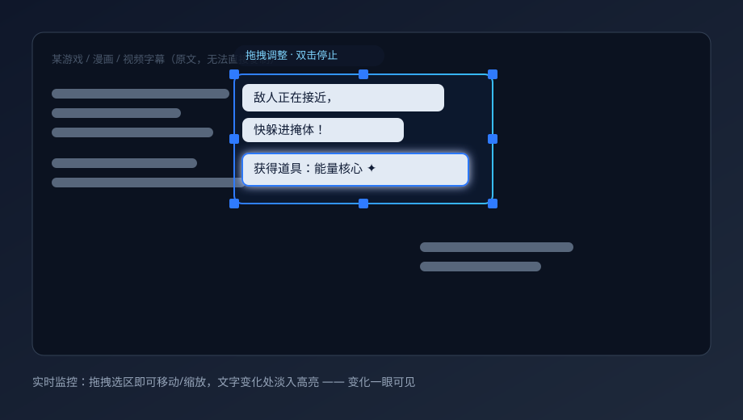

# ScreenTranslator

> Real-time, on-screen translation for anything you **can't copy**. Capture a region, recognize the text with Windows OCR or optional PaddleOCR, translate it, and overlay the result right where the original words were — live, with a draggable region and fade-in highlights for changes.

[](https://github.com/xuange-hu/screen-translator/stargazers)
[](LICENSE)
[](https://www.microsoft.com/windows)
[](https://www.python.org)
[](https://github.com/xuange-hu/screen-translator/releases)

**中文**：Windows 桌面截图翻译工具。截图（全屏 / 当前窗口 / 框选）→ Windows OCR 或可选 PaddleOCR 识别 → 自动翻译 → 用透明置顶覆盖层把译文盖在原文位置。新增**实时监控**：区域模式下开监控后可鼠标拖拽调整区域，新出现/变化的文字淡入高亮，变化一眼可见。



---

## Why ScreenTranslator

Some text simply cannot be selected: games, comics, videos, images, legacy desktop software, and web content behind canvas/DOM tricks. ScreenTranslator keeps the workflow short and stays out of your way:

**capture → recognize → translate → overlay**

- **Live region monitoring (NEW in v0.3).** Start monitoring a region, then drag to move or resize the watched area anytime. It only re-captures when the text actually changes, and newly appeared / changed lines **fade in with a highlight ring** — so you notice changes at a glance without re-reading everything.
- **Lightweight by default.** Uses the built-in Windows OCR engine — no models, no Paddle, no OpenCV downloaded on first run. Optional high-accuracy PaddleOCR is a one-click, checksum-verified component.
- **Private by default.** No screenshots or history saved unless you opt in; API keys are read from environment variables and never logged.
- **Pixel-accurate on any monitor setup.** Per-Monitor V2 DPI aware, multi-monitor (including negative coordinates), correct mapping across mixed scaling.

## Features

- Three capture modes: full screen, current window, and mouse drag-region. The current-window mode prefers native Win32 `PrintWindow` and only falls back to a validated visible-area capture.
- Region selection supports negative multi-monitor coordinates, exact open-interval coordinates, `Esc` to cancel, and a cross-scaling safety check.
- Default OCR is `Windows.Media.Ocr` (no bundled models). High-accuracy **PaddleOCR** is an optional component downloaded with a live progress bar, verified via HTTPS manifest, protocol version, file size, SHA-256, and Authenticode before atomic install.
- OCR emits unified text / rect / confidence / orientation / text-line output, with confidence filtering and adjacent-block merging.
- Unified `Translator` interface: built-in `Mock` (offline-testable), **Google free** (no key, concurrent block translation), MyMemory, OpenAI-compatible, DeepL, and Google Cloud Translation v2. Batch translation, exponential-backoff retry, timeout, request rate-limiting, and a JSON result cache.
- Protects numbers / URLs / emails / placeholders / variables before translation so they aren't mangled.
- Transparent always-on-top overlay: click-through, auto-wrap, auto font-shrink, light/dark text chosen by background brightness, semi-transparent background, global hide/show.
- Edit mode: drag individual translated blocks; `Esc` exits and closes the overlay.
- Global hotkeys via `pynput`, editable in settings with conflict detection.
- System tray with capture / full-screen / window / hide / edit / refresh / settings / quit.
- Correct Per-Monitor V2 DPI and multi-monitor (negative coordinates) coordinate consistency.
- Unified motion language: capture tick, themed selection shrink, progress dots, segmented reveal; supports reduced / eco motion strategies.
- OCR / translation / image processing all run on background `QThread`s — UI never blocks; re-entrancy is guarded with a config snapshot.
- Config in JSON; API keys prefer environment variables; logs are auto-redacted; screenshots and history are not saved by default.
- In-app update check and a one-click sanitized diagnostics ZIP (config, environment, recent logs — never screenshots, history, models, or keys).

## Quick start (from source)

Requires **Python 3.11+** (3.12 recommended).

```powershell
git clone https://github.com/xuange-hu/screen-translator.git
cd screen-translator
python -m venv .venv
.\.venv\Scripts\Activate.ps1
python -m pip install -r requirements-core.txt
python main.py
```

Run it, then press the capture hotkey and select a region. Default hotkeys:

| Hotkey | Action |
| --- | --- |
| `Ctrl+Shift+A` | Select a region and translate |
| `Ctrl+Shift+F` | Translate the full screen |
| `Ctrl+Shift+W` | Translate the current window |
| `Ctrl+Shift+H` | Hide / show the overlay |
| `Ctrl+Shift+R` | Re-recognize and re-translate the last capture |

### Live region monitoring

1. Capture a region as usual (`Ctrl+Shift+A`).
2. Start monitoring. The selection overlay stays on top with a faint border, eight resize handles, and a "拖拽调整 · 双击停止" hint.
3. **Drag inside** the box to move the whole watched area; **drag a handle** to resize. The capture follows on release.
4. New or changed text **fades in with a highlight**; unchanged text stays put — no full-screen flicker.
5. **Double-click** the region (or use the monitor toggle) to stop.

Default translation is **Google free** (`translate.googleapis.com` gtx endpoint — no registration, no key). If `OPENAI_API_KEY` / `DEEPL_API_KEY` / `GOOGLE_TRANSLATE_API_KEY` are detected, the app switches to the matching real service automatically; you can also pick a provider manually in settings.

> To enable high-accuracy OCR, open *Settings → OCR → Optional high-accuracy component* and click *Download PaddleOCR component*.

## Use cases

- **Games & visual novels** with text baked into the framebuffer.
- **Comics / manga / manhua** in a language you don't read.
- **Videos & streams** with hardcoded subtitles.
- **Legacy or locked desktop apps** where text can't be selected.
- **Web content** behind canvas / non-selectable DOM.

## How it works (technical)

### DPI & multi-monitor
The process enables Per-Monitor V2 (`SetProcessDpiAwarenessContext(-4)`) with graceful fallbacks, combined with Qt6 per-screen `devicePixelRatio`. Screenshots (mss) and `GetWindowRect` are physical pixels; Qt coordinates are logical. Each monitor keeps a `(physical rect, logical origin, dpr)` mapping; all conversions are done locally per monitor, then back to global. Overlay windows are created per monitor to avoid misalignment under mixed scaling. See `utils/dpi_utils.py`.

### Click-through overlay
Overlay windows use `FramelessWindowHint | WindowStaysOnTopHint | Tool | WindowTransparentForInput` plus `WA_TransparentForMouseEvents`, so clicks pass through to the app underneath. Edit mode temporarily disables pass-through to allow dragging blocks.

### OCR coordinate mapping
OCR returns boxes in the captured image's pixel space; the pipeline offsets them into global physical coordinates: `region.x = capture.bbox.left + box.x`. If the image's longest edge exceeds 4096, it is downscaled for recognition and coordinates are divided back by the scale.

### Translating variable-length text
The overlay auto-wraps and progressively shrinks the font (down to a minimum) based on the translation length and the text-box size, with a semi-transparent background for readability; if the translation is too long it contracts to fit the region height.

### Background threads
Each task spins a dedicated `PipelineTask(QThread)` and communicates with the main thread via Qt signals (status / error / result / finished). A new task cancels the old one; a `_stop` flag is checked across pipeline stages to prevent pile-up.

## Build a lightweight installer

```powershell
python -m pip install -r requirements-core.txt pyinstaller
.\scripts\build_lite.ps1 -Version 0.3.0-beta
```

This builds `dist\ScreenTranslator-Lite.exe` via `build-lite.spec`, then calls Inno Setup 6 to produce the installer. The build rejects packages ≥ 200,000,000 bytes. The lightweight archive explicitly excludes Paddle, PaddleX, OpenCV, SciPy, scikit-learn, and Torch.

Exe only: `.\scripts\build_lite.ps1 -Version 0.3.0-beta -SkipInstaller`

Traditional full package: `python -m PyInstaller build.spec --noconfirm` (not the default download for v0.3.0-beta).

### Code signing & releases
Tagged releases are produced by `.github/workflows/release-windows.yml`. The repository must configure these GitHub Actions secrets:

| Secret | Purpose |
| --- | --- |
| `WINDOWS_CERTIFICATE_PFX_BASE64` | Base64-encoded code-signing PFX |
| `WINDOWS_CERTIFICATE_PASSWORD` | PFX password |

The pipeline signs the main exe, installer, uninstaller, and PaddleOCR worker, calls a timestamp service, verifies Authenticode, re-checks size, and emits a matching `.sha256`. **Without signing credentials**, the pipeline skips signing and publishes an unsigned lightweight installer (the PaddleOCR component is skipped, since its manifest must be signed); **with** `WINDOWS_CERTIFICATE_PFX_BASE64` / `WINDOWS_CERTIFICATE_PASSWORD` configured, it signs everything and also ships the PaddleOCR component.

## FAQ

**Recognition returns nothing.** Install the Windows OCR language pack for the target language; lower *OCR → Minimum confidence*; for hard fonts download and switch to PaddleOCR; confirm the region actually contains text.

**OCR hangs after enabling text-orientation detection.** The orientation model can hang on some Paddle CPU builds. Disable *Enable text orientation detection* in settings; horizontal text is unaffected.

**Overlay is misaligned on a scaled monitor.** Make sure the system display scaling is applied. Cross-scaling region selection is explicitly rejected; complete the selection within a single screen.

**Hotkeys don't respond.** Another app (IME, recorder) may own them. Change the combo in *Settings → Hotkeys*; a failed registration is shown in the status bar.

**"No API key" for translation.** Set the env var or fill it in settings; the Mock translator needs no key.

**Rate limited / 429.** Online services retry automatically and keep the original text shown; lower *Request interval* or raise your quota.

**`ConvertPirAttribute2RuntimeAttribute not support`.** Known oneDNN bug in paddlepaddle 3.3.x on Windows CPU. Pin paddlepaddle to 3.2.x: `python -m pip install "paddlepaddle>=3.2.2,<3.3.0"`.

**Windows OCR asks for a language pack.** Install it, e.g. `Add-WindowsCapability -Online -Name "Language.OCR~~~en-US~0.0.1.0"`.

## Privacy

- Screenshots are not saved by default; image data is released after OCR/translation.
- *General → Save screenshots and recognition history* is off by default.
- Using an online translator sends recognized text to that third party (surfaced in the UI and docs).
- Logs never record recognized text, screenshots, or API keys.

## Roadmap

- **v0.2.5-beta: overlay fix release.** Fixed OCR text-block coverage, paragraph translation, natural font sizing, color matching, overlay layout, translation latency, and failure recovery.
- **v0.3.0-beta: live region translation (shipped).** Real-time change detection in a selected region; drag to adjust the area while monitoring; newly appeared / changed text fades in with a highlight.
- **v0.4: scene presets & glossaries.** Controlled presets for game subtitles, visual novels, vertical manga, video captions, plus terminology memory.
- **v1.0: signing, updates & stability.** Full release governance, long-run reliability, and natural overlay polish.

No mobile, macOS/Linux, browser-extension, cloud-account, or unrelated AI-chat scope.

## Contributing

Bug reports, feature ideas, and PRs are welcome. Please read [CONTRIBUTING.md](CONTRIBUTING.md) first. **Never commit API keys, local config, screenshots, or model caches.**

## ⭐ Help it grow

If ScreenTranslator saves you time, a star is the cheapest way to help others find it — and it tells me which features to prioritize. Share it on your favorite community (see the submission copy in the repo discussions / issues), and open an issue with what you'd translate with it.

## License

[MIT](LICENSE) © 2026 ScreenTranslator contributors.
